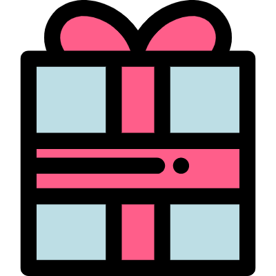

<p align="center"></p>
<h1 align="center">Giftie</h1>
<p align="center">
  <a target="_blank" href="https://kyrieliu.cn"></a>
  <a href="javascript:void(0)"></a>
  <a href="javascript:void(0)"></a>
  <a href="javascript:void(0)"></a>
  <a target="_blank" href="https://kyrieliu.cn/images/qrcode.jpg"></a>
</p>
  
## :sparkles: 介绍
Giftie 是一个用来搞定「**送礼问题**」的**终极解决方案**。  
采用「自定义文案」+「自定义礼物」+「抽奖」的形式，让礼物的接收方（母亲/妻子/女友）感受到来自于你的真心和爱意。  
  
<br><br><br>

## :chestnut: 示例
<p align="center"></p>
<p align="center">（仅支持微信内访问，请用微信扫描二维码查看示例）</p>
  
<br><br><br>

## :bookmark: 使用指引
### :star: 点击 star
在 Github 上点击 star，就会持续关注当前项目（可通过个人主页快速找到当前项目）；以及，可以小小的满足一下作者的虚荣心，为以后的迭代提供动力。
> 科普：star 相当于关注/收藏/点赞。  
  
<br>

### :loop: 点击 fork 并自定义配置文件
Fork 之后，你就可以在这份「自己的代码」仓库中进行定制化的配置了。  
Giftie 将一切可以 DIY 的变量都放在了配置文件 ```gift.setting.js``` 中，每个字段上都标记了详细的注释，这里我们可以快速的过一下关键字段：  
```javascript
// 控制项目全局状态的关键 key，如非特殊情况或覆盖使用，则不用修改
export const GLOBAL_KEYS = {
  EXIST_KEY: 'HAS_GIFT',
  NAME_KEY: 'GIFT_NAME',
  IMAGE_KEY: 'GIFT_IMAGE_URL',
};

// 是否允许对方在抽奖结束后重新抽奖
// 建议调试的时候保留，给对方使用时去掉
export const IS_SHOW_RESTART = false;

// 首页配置（主要是文案，暂不支持修改主题）
export const homeConfig = {
  // 主标题
  title: '520送礼抽奖',
  // 留言，数组的每一项代表一行
  messages: [
    { key: 'a', wording: '这是第一行文案', },
    { key: 's', wording: '这是第二行文案', },
    { key: 'd', wording: '然后，这里是第三行文案', },
  ],
  // 最终解释权归属人
  owner: 'XXX',
  // 抽奖转盘的动画时间，单位毫秒
  timeout: 5000,
  // 指定中奖的礼物下标，从 0 开始
  targetGiftIndex: null,
};

// 礼物清单
// 字段 key 不用改，只要保证每个礼物的 key 字段是不同的即可
// 图片放在 public/images 中，建议是正方形，否则影响视觉体验
// name 是礼物的全称；alias 是礼物的简称（用来显示在抽奖方格里）
export const gifts = [
  { key: 'q', name: 'Dior双飞套装', alias: 'Dior双飞', image: '/images/1.png',  description: '「经典迷人色彩，彰显奢华魅力」' },
  { key: 'w', name: '腾讯视频终身VIP', alias: 'VIP', image: '/images/2.png',  description: '“为你承包一辈子的 VIP”' },
  { key: 'e', name: '兰蔻小黑瓶套装', alias: '小黑瓶套装', image: '/images/3.png',  description: '「强维稳，快修护」' },
  { key: 'r', name: '520红包', alias: '520', image: '/images/6.png',  description: '“想给你唱一百首情歌”' },
  { key: 't', name: 'Dior星空套装', alias: 'Dior星空', image: '/images/5.png',  description: '「百变唇妆，精美雕琢」' },
  { key: 'y', name: '1314红包', alias: '1314', image: '/images/6.png',  description: '“从今往后，我都会在你旁边”' },
  { key: 'u', name: 'UR购物券：¥1,000', alias: 'UR', image: '/images/7.png',  description: '“UR！买！”' },
  { key: 'i', name: 'Dyson美发套装', alias: '戴森', image: '/images/8.png',  description: '「不同造型需求，全面满足」' },
];
```
注意，配置礼物时请自行找礼物图片，为了保障视觉体验，请选用**正方形**且已经过**体积压缩**的图片。  
  
<br>

### :rocket: 部署
修改完配置检查没问题后，就可以上线了。  
Build 后的文件直接放在自己的服务器上即可。如果没有自己的服务器，推荐使用[腾讯云的静态网站托管服务](https://cloud.tencent.com/document/product/876/40270)。  
> Tip: 本项目是一个「纯前端」项目，关键状态都保存在客户端（localStorage）中，毕竟是一个 MVP 的产品，也不会有谁的母亲/老婆/女友会删掉客户端状态重新抽(zuò)奖(bì)吧，不会吧不会吧？如果有觉得不稳妥的朋友，也可以改造成数据库中保存用户状态的模式。  
  
<br><br><br>

## :flags: 未来规划
- 支持多种字体
- 支持多种主题
- 支持根据自定义抽奖模式（转盘 or 九宫格）
- 更灵活的文案配置  
  
:star2: 如果 Giftie 对你有帮助，欢迎用 star 来表达对我的支持，Thx～  
  
<br><br><br>

## :green_heart: 最后
关注我的个人原创公众号，第一时间 get 更多好玩有趣的文章/项目，让前端变得更有趣 :stuck_out_tongue_closed_eyes:  
<p align="center"></p>
